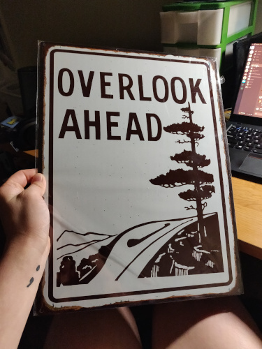

+++
title = "Going Home"
date = 2019-05-30T21:16:00Z
+++

I've been crazy busy these past few weeks. I moved in to a new place for the summer, and I love it. I'm taking summer classes to catch back up on my degree, and they're going smoothly. I also went to pick up my girlfriend Kylie's gift from Linville Falls. I got her a sign that says "Overlook Ahead", pictured below:

The story behind this sign is pretty cute. Kylie and I took a trip to Knoxville to meet a friend of mine. We purposely took the long way through the mountains and experiened a beautiful drive that I'll never forget. Unfortunately we didn't record GPX files for this trip, but it was very romantic and meaningful. On the way back we constantly passed these signs that said "Overlook Ahead". We saw at least thirty before losing count.

I'm very slowly becoming an OpenStreetMap contributor, I downloaded OsmAnd from F-Droid and made my first contribution (my own apartment!) on the main website. But yeah, I only remembered to record my track on the way back from two major events this month. The first one was from Linville Falls:

{{ leaflet(id="linville-falls-to-boone", gpx="/gpx/2019-05-30-linville-falls-to-boone-2019-05-21.gpx") }}

I've been stuck without a car for a little while, it's being fixed in Cary after a bad accident. So this trip ended up being me, my friend Maddie and my roommate Felix. Maddie was so kind to let me borrow her car to get the gift. I could only find this sign at the gift shop near Linville Falls. 

The other trip embedded here is Kylie and I travelling back from Cary after we met my parents. 

{{ leaflet(id="cary-to-boone", gpx="/gpx/2019-05-30-cary-to-boone-2019-05-24.gpx") }}

We made this trip a week after I moved in to my apartment. I was beginning to get pretty sick with a cold during the trip, but it was still really fun. I am so glad that Kylie got to meet my family. 

My sickness was pretty gnarly this time around. I really hate being sick. It started with a cold, which got as bad as colds usually do. Around the same time I got a sore in my mouth. I learned soon that the sore is called a Canker sore, which can be apparently caused by eating tomatoes. The combination of a poor immune system and lots of chili gave me like 20 or so in my mouth. They're pretty painful. Also, I got a bunch of cold sores on my mouth. They got really ugly after a few days, so I went to health services on campus to get a few drugs to help them. 

Anyway despite sickness I'm doing pretty well. I've settled into my classes and I feel at home in my apartment. I want to write more posts like this because I like talking about myself and relating my experiences to people.
