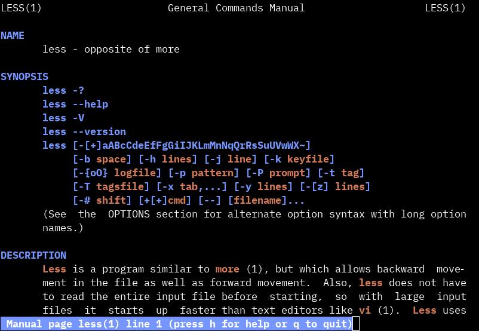

+++
title="manpage colors"
date=2019-07-17
+++

I'd been fooling around with manpage colors. Most thanks goes to [this blogpost](https://boredzo.org/blog/archives/2016-08-15/colorized-man-pages-understood-and-customized) for laying the groundwork, and [this post](https://gist.github.com/XVilka/8346728) (with [this wikipedia article](https://en.wikipedia.org/wiki/ANSI_escape_code#8-bit)) for sort of explaining how to escape true colors.

Some of the terms in the posts were a bit confusing for me, so along with this snippet I'll try to explain in my own words what they mean.

```sh
colorman() {
    # md: start bold
    # me: turn off bold, blink, and underline
    # so: start standout (reverse video)
    # se: stop standout
    # us: start underline
    # ue: stop underline
    LESS_TERMCAP_md=$'\e[01;38:2:117:150:255m' \
    LESS_TERMCAP_me=$'\e[0m' \
    LESS_TERMCAP_so=$'\e[01;48:2:117:150:255m' \
    LESS_TERMCAP_se=$'\e[0m' \
    LESS_TERMCAP_us=$'\e[01;38:2:211:122:86m' \
    LESS_TERMCAP_ue=$'\e[0m' \
    command man "$@"
}
alias man=colorman
```

`md` and `me` are the primary emphasis modes. The first section of the escape sequence, `01`, sets the text to bold mode. `so` and `se` is standout mode, which as far as I can tell only applies to the progress bar on the bottom left. `us` and `ue` are underline mode, which is the other mode of emphasis the manpage supplies. 

This ends up looking pretty cool (if I do say so myself):



Lately, I've been more and more able to be sort of proud of what I do. I'm letting myself share little things like this and not feel like I'm copying something or someone. It's really nice. I've also been working on generalizing my dotfiles, and creating an install script for new servers I provision. The whole thing is slightly cobbled together, so I don't really feel like trying to explain it in a post.

